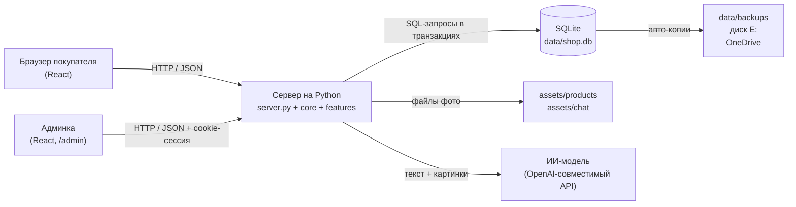

# Отчёт: обмен и хранение данных на платформе «Мебель»

## 1. Архитектура в двух словах

- **Фронтенд:** React 19 + Vite. Собирается в папку `dist/`, её отдаёт тот же сервер.
- **Бэкенд:** Python 3.11, стандартный `ThreadingHTTPServer`, адрес `127.0.0.1:8780`. Каждый запрос обрабатывается в отдельном потоке.
- **Структура бэкенда:** ядро плюс функции.
  - `core/` — ядро: база данных, HTTP, авторизация, настройки, ИИ.
  - `features/` — отдельные функции: `catalog`, `crm`, `chat`, `admin_status`, `spa`.
  - Каждая функция сама создаёт свои таблицы (`setup`) и сама регистрирует свои адреса API (`register`).
- **Обмен данными:** фронтенд и сервер общаются только через JSON-запросы к `/api/...`.

## 2. Как обмениваются данные

### 2.1 Товары (каталог)

| Действие | Кто | Запрос |
|---|---|---|
| Показать витрину | покупатель | `GET /api/products` (только видимые товары) |
| Список в админке | админ | `GET /api/admin/products` |
| Добавить / изменить / удалить | админ | `POST /api/products`, `PUT/PATCH /api/products/{id}`, `DELETE /api/products/{id}` |
| Загрузить фото | админ | `POST /api/upload` (JPG, PNG, WEBP) |

- Сервер проверяет данные. Цена и количество ограничиваются разумными пределами, а неверные значения вроде `Infinity` или текста отклоняются с ошибкой 400.
- Фото хранятся файлами в `assets/products/`. В базе лежит только путь к файлу.
- При удалении товара удаляются только те фото, которые больше никому не нужны. Раз в сутки удаляются «осиротевшие» загрузки старше 24 часов.

### 2.2 Корзина

- Корзина хранится **только в браузере покупателя**, в `localStorage` (`src/context/CartContext.jsx`). На сервер она не отправляется, пока покупатель не оформит заказ.
- Плюсы: корзина работает мгновенно и не нагружает сервер.
- Минус: корзина привязана к одному браузеру и устройству.

### 2.3 Заказы

Как проходит оформление заказа:

1. Покупатель нажимает «Заказать» (из корзины, карточки товара, калькулятора или чата).
2. Если имя и телефон ещё не известны, открывается форма `LeadModal`.
3. Фронтенд отправляет `POST /api/orders` (`src/context/CrmContext.jsx`).
4. Сервер (`features/crm/service.py → create_order`):
   - проверяет имя (минимум 2 символа) и телефон (формат `+7XXXXXXXXXX`);
   - **берёт названия и цены из базы, а не из запроса**, так что подменить цену из браузера нельзя;
   - ограничивает частоту: не больше 8 заявок в минуту с одного IP (иначе ответ 429);
   - в **одной транзакции** находит или создаёт клиента, записывает заказ и пересчитывает статистику клиента.
5. Только после успешного сохранения открывается WhatsApp с текстом заказа. Если сохранить не удалось, покупатель видит ошибку, и заказ не теряется молча.

В админке заказы можно смотреть, менять статус и заметку и удалять: `GET /api/admin/orders`, `PATCH /api/orders/{id}`, `DELETE /api/orders/{id}`.

### 2.4 Клиенты (CRM)

- Отдельной формы регистрации нет: **клиент создаётся автоматически при первом заказе**.
- Телефон приводится к единому виду: `8 (900) 111-22-33`, `+7 900 1112233` и `9001112233` превращаются в `79001112233`.
- В базе стоит **уникальный индекс по телефону**. Поэтому даже если два заказа от одного человека приходят в одну и ту же секунду, клиент будет один.
- Число заказов и дата последнего заказа пересчитываются SQL-запросом по реальным заказам, а не прибавлением «+1». Поэтому счётчик не расходится с действительностью.
- В админке клиента можно скрыть, вернуть и снабдить заметкой: `GET /api/admin/clients`, `PATCH /api/clients/{id}`.

### 2.5 Чат-виджет с ИИ-консультантом

1. Покупатель пишет сообщение. Через «+» можно прикрепить файл или фото.
2. Фронтенд отправляет `POST /api/chat`, а в запросе:
   - текст;
   - историю диалога;
   - `chat_id` (хранится в `sessionStorage`, чтобы все сообщения попадали в один диалог);
   - вложения.
3. Сервер:
   - сохраняет файлы в `assets/chat/`;
   - извлекает текст из документов (парсинг), а картинки передаёт ИИ, чтобы тот их «видел»;
   - добавляет к запросу актуальный каталог товаров из базы;
   - получает ответ ИИ-модели (OpenAI-совместимый API, модель по умолчанию `gpt-4o-mini`; без ключа работает локальный режим).
4. Вопрос и ответ записываются в базу **одной транзакцией**, как пара сообщений. Ситуации «вопрос сохранился, ответ нет» не бывает.
5. Админ видит диалоги через `GET /api/admin/chats`.

### 2.6 Админка и безопасность

- Вход: `POST /api/login`. Сервер выдаёт cookie-сессию со сроком 7 дней.
- В базе хранится **не сам токен, а его хеш (SHA-256)**. Даже с копией базы чужую сессию не подделать.
- Все админские адреса помечены `auth=True`, и без входа сервер отвечает 401.
- Секреты (ключ ИИ, пароль) лежат в `.env`, а `.env` не попадает в git.

## 3. Какая база данных используется

**SQLite 3** — встроенная база, которая хранится одним файлом `data/shop.db`.

Почему выбрана она:

- не требует установки отдельного сервера БД и входит в Python;
- настоящие транзакции (ACID): запись проходит либо целиком, либо никак;
- для одного сайта с одним сервером её производительности хватает с большим запасом;
- легко копировать и восстанавливать, потому что это один файл.

Раньше данные хранились в JSON-файлах. Их полностью перенесли в SQLite:

- каждое поле сверено после переноса;
- оригиналы сохранены в `data/legacy/`.

### Таблицы

| Таблица | Что хранит |
|---|---|
| `products` | товары (название, категория, цена, количество, описание, фото, видимость) |
| `orders` | заказы (клиент, телефон, состав заказа, статус, заметка, текст для WhatsApp) |
| `clients` | клиенты (имя, телефон, число заказов, последний заказ, заметка, скрыт или нет) |
| `chats` | диалоги чат-виджета |
| `chat_messages` | сообщения диалогов (роль user/assistant, текст, вложения) |
| `sessions` | сессии админа (только хеши токенов со сроком действия) |
| `settings` | настройки сайта |
| `schema_migrations`, `meta` | служебные таблицы: какие обновления структуры уже применены |

Связи между таблицами:

- заказ ссылается на клиента, и при удалении клиента заказ **не удаляется**;
- сообщение ссылается на диалог, и при удалении диалога его сообщения удаляются вместе с ним.

## 4. Как данные сохраняются и хранятся надёжно

Вся работа с базой собрана в одном месте — `core/db.py`.

| Механизм | Что даёт |
|---|---|
| **Транзакции `BEGIN IMMEDIATE`** | связанные изменения (клиент + заказ + статистика) записываются вместе или не записываются вовсе |
| **Режим WAL** | посетители могут читать данные, пока идёт запись, и никто не ждёт |
| **`synchronous=FULL`** | сервер отвечает «сохранено» только после того, как данные физически записаны на диск |
| **`busy_timeout` 30 с** | при одновременной записи запросы выстраиваются в очередь, а не падают с ошибкой |
| **`foreign_keys=ON`** | база сама следит, чтобы связи между таблицами не ломались |
| **Проверка целостности при запуске** | `quick_check` сразу сообщает, если файл базы повреждён |
| **Миграции** | структура таблиц обновляется по шагам, и каждый шаг применяется ровно один раз |
| **Автобэкапы** | копия базы делается при каждом запуске и раз в сутки, хранятся по 14 штук, дублируются на диск E: и в OneDrive |
| **Защита от второго запуска** | второй экземпляр сервера на том же порту не запустится и не будет мешать первому |
| **Очередь подключений 256** | при наплыве посетителей соединения ждут в очереди, а не получают отказ |

## 5. Доказательства (проведённые тесты)

Тесты шли на изолированной копии сайта и базы, настоящие данные не затрагивались. Результат: **22 из 22 проверок пройдены**.

1. Заказ с сайта сохраняется в базе, виден в админке, клиент создаётся автоматически.
2. Повторный заказ с телефоном в другом формате не создаёт дубль клиента, а число его заказов становится 2.
3. Изменения статуса и заметки сохраняются.
4. 100 посетителей в одну секунду получили ответ все (0 отказов), и сохранено 200 сообщений из 200.
5. На «мусорные» запросы, огромные числа и попытки SQL-инъекции сервер вежливо отвечает 400. Данные не испорчены, сайт работает.
6. Сервер принудительно «убивали» во время записи. Все 32 записи, которые сервер успел подтвердить, остались на месте, сессия сохранилась, `integrity_check` вернул `ok`.
7. Реальные данные целы: 20 товаров, 32 заказа, 19 клиентов, 67 диалогов (186 сообщений).
8. Резервные копии во всех трёх местах открываются и содержат все заказы.

**Найдено и исправлено в ходе проверки:** очередь подключений к серверу была рассчитана всего на 5 человек, и при 40 одновременных посетителях 3 получили отказ. Очередь увеличена до 256, повторный тест со 100 посетителями прошёл без отказов.

## 6. Ограничения и что можно улучшить

- **Корзина живёт только в браузере.** Если покупатель сменит устройство, корзина не перенесётся. Для такого магазина это нормально, но при желании корзину можно хранить на сервере.
- **SQLite рассчитана на один сервер.** Если сайт вырастет до нескольких серверов или тысяч одновременных заказов, стоит перейти на PostgreSQL. Работа с базой собрана в `core/db.py`, поэтому переход будет локальным.
- **Счётчик «8 заявок в минуту» хранится в памяти.** После перезапуска сервера он обнуляется. Это не критично.
- **Файлы (фото товаров, вложения чата) лежат на диске, а не в базе.** Они не входят в автобэкап базы, и их стоит копировать отдельно.
- **Текст и картинки из чата уходят внешнему ИИ-сервису.** Это стоит упомянуть в политике конфиденциальности.
- **В `core/config.py` есть запасной пароль админа** на случай, если его не задали в `.env`. На боевом сервере пароль обязательно должен быть задан в `.env`.
